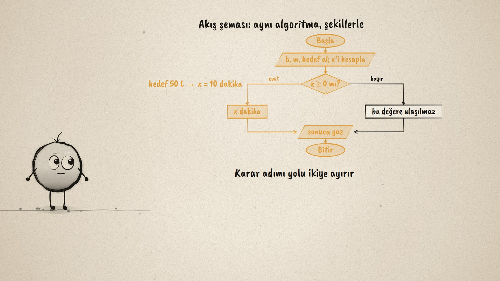
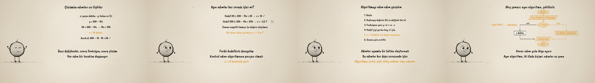

# Depo Boşalıyor · Linear Problems as Algorithms

**▶ Tarayıcıda izleyin / Watch in the browser:** https://hakanatas.github.io/depo-bosaliyor/ 
**⬇ MP4 + altyazılar / MP4 + subtitles:** [Releases](https://github.com/hakanatas/depo-bosaliyor/releases) 
**✎ Kullanılan istem / The prompt behind it:** [PROMPT.md](PROMPT.md) 
**🎞 Bütün filmler / All films:** [Nokta'nın Filmleri](https://hakanatas.github.io/nokta-filmleri/?sinif=8)

> **TR —** 8. sınıf matematik "Cebirsel Düşünme ve Değişimler" temasındaki MAT.8.2.4 öğrenme çıktısı için hazırlanmış, tamamen JavaScript ile çizilen 92 saniyelik mürekkep animasyonu. Bir depoda 200 L su var, dakikada 15 L boşalıyor: kaç dakika sonra 50 L kalır? Çözümün adımları ve ilişkileri açıklanıyor: değişkenler (x dakika, y litre), fonksiyon y = 200 − 15x, denklem 50 = 200 − 15x ve x = 10, kontrol. Aynı adımlar farklı hedeflerle deneniyor: 20 L için x = 12, 250 L için x = −3,3 çıkıyor; zaman negatif olamayacağından algoritmaya bir karar adımı (x ≥ 0 mı?) ekleniyor. Algoritma önce numaralı adımlarla, sonra akış şemasıyla uyumlu bir bütün olarak yazılıyor ve iki hedef için izleniyor. Altyazılar Türkçe, İngilizce ya da ikisi birlikte seçilebilir.

A 92-second ink animation for **8th-grade maths**. Nokta, the ink character from [The Learning Ink](https://github.com/hakanatas/the-learning-ink), is the guide again. The flowchart is built by `flow` in `scenes/scene1.js` from the same node and arrow helpers as the earlier cargo-price film; a `path` argument lights the route that one input takes, so the yes and no branches can be traced for 50 L and for 250 L.

## Learning outcome

MEB, Türkiye Yüzyılı Maarif Modeli, Ortaokul Matematik, 8th grade, "Cebirsel Düşünme ve Değişimler" theme:

**MAT.8.2.4. Doğrusal fonksiyonlara ilişkin problemlerin çözümlerini algoritma ifade yöntemlerini kullanarak yapılandırabilme**
- a) Doğrusal fonksiyonlara ilişkin problemlerin çözümlerindeki adımları ve ilişkileri açıklar.
- b) Algoritma ifade yöntemlerini kullanarak incelediği adımlar ve ilişkilerden uyumlu bir bütün oluşturur.

## Scenes

| # | Time | Scene | What happens | Outcome |
|---|---|---|---|---|
| 1 | 0–10 s | Depo | 200 L, 15 L a minute: when are 50 L left? | a |
| 2 | 10–28 s | Adımlar | Variables, y = 200 − 15x, x = 10, a check. | a |
| 3 | 28–46 s | Karar | 20 L works; 250 L gives x = −3,3: a decision step is needed. | a |
| 4 | 46–64 s | Adım listesi | The algorithm as numbered steps. | b |
| 5 | 64–80 s | Akış şeması | The same algorithm as a flowchart, traced for 50 L and 250 L. | b |
| 6 | 80–92 s | Aklında kalsın | Ordered, clear and complete. | a–b |

## Running it

- **Preview:** double-click `index.html` (it works offline).
- **MP4:** run `npm install` once, then `npm run export -- --format=horizontal --captions=tr`.
- **Subtitles and narration:** `npm run srt` writes `out/captions_*.srt` and `narration_notes.txt`.
- **Editing:**
  - Caption text, timings and narration notes: `captions.js`
  - Everything on screen is drawn by `LI.world(t)` in `scenes/scene1.js` (the steps, the flowchart, the words); the other scenes only set the camera.
  - Nokta's poses: `src/draw/film.js`; layout for 16:9 and 9:16: `src/draw/kd.js`

It uses the same engine as The Learning Ink: `renderFrame(t)` as a pure function of time, seeded randomness, and frame-by-frame export.
